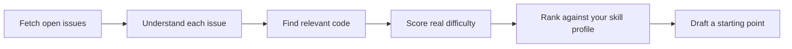

# Code Compass 🧭

[](https://github.com/upskill-hamza/code-compass/actions/workflows/tests.yml)

**Stop guessing which open-source issue you can actually finish.**

"Good first issue" labels are stale, inconsistently applied, and often wrong the moment a maintainer adds one clarifying comment. Code Compass reads the actual issue, the actual discussion, and the actual code — then tells you which issues genuinely fit your skill level and the time you have, with a concrete first step for each.

It's an agentic AI pipeline (LangGraph + local vector search) wrapped in a real dashboard, built entirely on free-tier tools.

---

## How it works

Point Code Compass at any public GitHub repo and it runs every open issue through a 5-stage pipeline:



1. **Fetch** — pulls every open issue and its full comment thread from GitHub
2. **Understand** — an LLM reads the issue *and* the comments, since scope often drifts or gets clarified after the original post — something a label never captures
3. **Find relevant code** — a local vector search (no API cost) maps each issue to the actual files and functions it likely touches
4. **Score difficulty** — reasons over file count, whether the change touches core abstractions, and test coverage to estimate real difficulty and time investment
5. **Rank** — combines difficulty with *your* stated experience level and available time to produce a personalized match score
6. **Starting point** — for your top matches, drafts a concrete first move, referencing a similar past merged PR when one exists

No step relies on a GitHub label. Every ranking is explainable — the tool tells you exactly why an issue landed where it did.

---

## Screenshot

*(add a screenshot of the results dashboard here)*

---

## Tech stack

Everything here runs on free tiers or locally — no API costs required to run this project.

| Layer | Tool |
|---|---|
| Agent orchestration | [LangGraph](https://github.com/langchain-ai/langgraph) |
| LLM | [Groq](https://console.groq.com) free tier (`openai/gpt-oss-120b`) |
| Vector search | [ChromaDB](https://www.trychroma.com/) with local embeddings (no API calls) |
| Backend API | [FastAPI](https://fastapi.tiangolo.com/) |
| Frontend | React (Vite) + Tailwind CSS |
| GitHub data | GitHub REST + Search API |

---

## Getting started

### Prerequisites

- Python 3.10+
- Node.js 18+
- A free [GitHub personal access token](https://github.com/settings/tokens) (only needs `public_repo` read scope)
- A free [Groq API key](https://console.groq.com)

### 1. Backend setup

```bash
git clone "https://github.com/upskill-hamza/code-compass.git"
cd code-compass
pip install -r requirements.txt
```

Copy `.env.example` to `.env` and fill in your keys:

```
GITHUB_TOKEN=your_token_here
GROQ_API_KEY=your_key_here
```

Start the API server:

```bash
cd src
uvicorn main:app --reload --port 8000
```

The API is now running at `http://localhost:8000` (interactive docs at `/docs`).

### 2. Frontend setup

In a separate terminal:

```bash
cd frontend
npm install
npm run dev
```

Open `http://localhost:5173` — fill in a repo and your skill profile, and hit **Find my issues**.

---

## API reference

| Endpoint | Method | Description |
|---|---|---|
| `/analyze` | `POST` | Starts analysis for a repo. Returns a `job_id` immediately (analysis runs in the background). |
| `/status/{job_id}` | `GET` | Poll for job status: `pending` → `running` → `done` / `error`. |
| `/results/{job_id}` | `GET` | Returns the final ranked issue list once status is `done`. |

Example request body for `/analyze`:

```json
{
  "repo_owner": "Textualize",
  "repo_name": "rich",
  "skill_profile": {
    "languages": ["Python"],
    "frameworks": ["LangChain"],
    "experience_level": "beginner",
    "time_available": "few hours"
  },
  "max_issues": 10,
  "top_n_starting_points": 3
}
```

---

## Project structure

```
code-compass/
├── src/
│   ├── github_client.py          # GitHub REST + Search API wrapper
│   ├── state.py                  # Shared LangGraph state schema
│   ├── issue_understanding_node.py
│   ├── repo_indexer.py           # Clones repo, builds local vector index
│   ├── code_context_node.py
│   ├── difficulty_scoring_node.py
│   ├── personalized_ranking_node.py
│   ├── starting_point_node.py
│   ├── graph.py                  # Wires all nodes into one LangGraph graph
│   ├── job_manager.py            # Background job tracking for the API
│   ├── main.py                   # FastAPI app
│   └── test_*.py                 # Offline test suite for every module
├── frontend/
│   ├── src/
│   │   ├── App.jsx
│   │   ├── api.js
│   │   └── components/
│   └── ...
├── requirements.txt
└── .env.example
```

---

## Known limitations

- **In-memory job store** — analysis jobs are lost if the API server restarts. Fine for local/single-instance use; a production deployment would want a real queue.
- **No index caching** — each analysis re-clones and re-indexes the repo from scratch. Fast for small-to-medium repos, slower for very large ones.
- **English-language issues** — the understanding pipeline is tuned for English issue text.
- **Python-weighted difficulty heuristics** — works across languages, but difficulty reasoning has been tuned primarily against Python codebases so far.

---

## Roadmap

- [x] GitHub issue fetching with comment threads
- [x] LLM-powered issue understanding (scope-drift detection)
- [x] Local vector search for code context
- [x] Personalized difficulty scoring and ranking
- [x] Starting-point generation with similar-PR references
- [x] LangGraph pipeline wiring
- [x] FastAPI backend
- [x] React dashboard
- [ ] Multi-language difficulty tuning
- [ ] Persistent index caching across runs

---

## Contributing

This project is itself meant to help people find their first good contribution — so contributions to Code Compass are welcome. Check the Issues tab, or open one if you've hit a rough edge.

## License

MIT — see `LICENSE`.